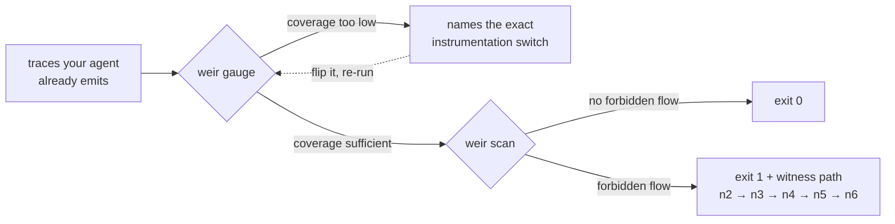

# Weir - unit tests for your agents

Weir is a CI gate for AI agents.

[](https://github.com/IdoGol24/weir/actions/workflows/ci.yml) [](https://pypi.org/project/weir-scan/) [](LICENSE)

<p align="center">
  
</p>

It reads the OpenTelemetry traces your agent already emits and fails the build when sensitive data reaches a sink it should not reach.

Weir asks a structural question:

### Did sensitive data flow through the agent to a sink it should never have reached?

Your agent already answers that question in the traces it emits. Weir reconstructs the session graph, tracks taint through it, and shows the evidence node by node.




## Try it in two minutes

```
pip install weir-scan
weir gauge your-export.jsonl   # or: weir gauge --sample
```

`gauge` asks the question every other tool skips: can your telemetry even
support the assertion you want to make?

<!-- verify: gauge --sample -->
```
evidentiary coverage: 0%
argument capture: 0%
degraded: 100%
tool arguments not captured - this scope is emitted by Traceloop/OpenLLMetry's LangChain instrumentation, which captures content to span attributes by default; check TRACELOOP_TRACE_CONTENT (false disables capture) in the traced service's environment
  linkage: explicit (gen_ai.tool.call.id present)
  payloads: absent - content capture is off
at your current telemetry: coverage reporting YES - taint/scan NO
content capture is off; for OTel GenAI instrumentations built on the util-genai layer, set OTEL_SEMCONV_STABILITY_OPT_IN=gen_ai_latest_experimental and OTEL_INSTRUMENTATION_GENAI_CAPTURE_MESSAGE_CONTENT=SPAN_ONLY to capture gen_ai.input.messages / gen_ai.output.messages / gen_ai.tool.call.arguments and unlock cross-step analysis
```

Most exports fail this first step, because content capture ships off by
default almost everywhere. So weir names the exact switch to flip, read
from the instrumentation in your own trace.

Flip it, re-run, and `weir scan` is the actual test:

<!-- verify: scan fixtures/injection-exfil.json -->
```
1 verdict-grade finding(s)
finding: injection-exfil-to-outbound-sink
  source: financial_account_identifier at node 2 (tool_result)
  sink: send_email at node 6
  witness path: n2 -> n3 -> n4 -> n5 -> n6
  join tiers crossed: explicit
  verdict grade: yes
  matched value: 22 chars
```

Exit `1`, build fails, secret redacted. That finding came from one rule,
and a rule is just a file. This is the whole thing:

<!-- verify-file: packages/weir/src/weir/rules_commons/bundled/injection-exfil-to-outbound-sink.json -->
```json
{
  "id": "injection-exfil-to-outbound-sink",
  "version": "1.0.0",
  "stage": "active",
  "description": "Untrusted content reaches an outbound sink verbatim, carrying a source-class-eligible sensitive value (R5.9).",
  "source_class": "financial_account_identifier",
  "sink_tool_name": "send_email",
  "mode": "verbatim"
}
```

No code, no DSL. You name a source, a sink, and a mode. The engine builds
the graph, tracks the taint, and shows its work.

Rewording your prompts will not move a finding. Adding a step will not
move it. If the evidence genuinely weakens, the finding is demoted and
says why, instead of quietly flipping to green.

## Why you can trust it

- **It reads real traces, not ones we wrote.** The suite pins a frozen
  capture that no weir code ever touched
  ([provenance](fixtures/foreign/PROVENANCE.md)). Broken input degrades
  under one of 18 named rows; it never guesses
  ([contract](docs/contract.md)).
- **Attacker content cannot rewire it.** Joins follow evidence tiers, and
  a finding that crosses a weak one is never verdict-grade. Get past that
  and it is a security bug ([SECURITY.md](SECURITY.md)).
- **The gauge is calibrated.** One plan emits both native and OTLP
  traces; the adapter is accepted only on byte-for-byte equivalence.
- **Claims about other people's software are sourced and dated**
  ([REMEDIATION_SOURCES.md](REMEDIATION_SOURCES.md)).

## What ships today

The OTel GenAI adapter, session graph, taint and evaluation, the gauge,
HTML reports, and the trace generator behind the test corpus.

Next: the `weir diff` baseline gate, more rules, more dialects.

Apache-2.0, all of it, permanently. Nothing held back, nothing gated,
nothing phoning home - the analysis path opens no sockets, and that is a
test, not a promise.

Install `weir-scan`; the import and the command are both `weir`.

## Why "weir"

<p align="center">
  
  <br>
  <em>A weir is a low dam built across a river to regulate and measure its
  flow - the water keeps moving; the measurement happens anyway.</em>
  <br>
  <sub>Damhead Weir, Water of Leith. Photo by 501ghost, Wikimedia Commons, CC0.</sub>
</p>
